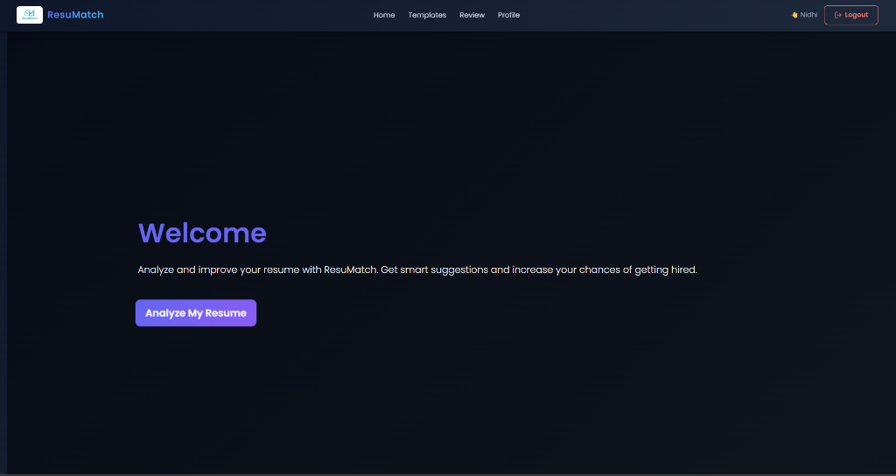

# 🚀 ResuMatch — AI-Powered Resume Ecosystem



## 🌟 Overview

**ResuMatch** is a full-stack MERN application designed to help job seekers optimize their resumes for Applicant Tracking Systems (ATS). It provides deep resume analysis, real-time scoring, and professional template generation, all secured with multi-factor authentication (MFA).

---

## ✨ Features (V1.0)

### 📄 Intelligent Resume Parsing
*   **PDF & DOCX Support**: Seamlessly upload and process your resume.
*   **Structured Extraction**: Automatically identifies `name`, `email`, `phone`, `skills`, `experience`, `education`, and `projects` using advanced regex patterns.

### 📊 Precision ATS Scoring
*   **Score Calculation**: A real-time 0–100 score based on 8 critical resume dimensions.
*   **Actionable Feedback**: Real-time "Positives" and "Improvements" suggestions to help you rank higher.
*   **Grade Labeling**: Instant grading (Excellent, Good, Average, etc.) to gauge your readiness.

### 🎨 Professional Resume Generation
*   **6 Modern Templates**: Choose from a variety of distinct, industry-standard designs.
*   **Auto-Population**: Your parsed resume data automatically fills the template of your choice.
*   **One-Click Download**: Generate polished, recruitment-ready PDFs.

### 🔐 Security & Privacy
*   **MFA (TOTP)**: Secure your account with Google Authenticator using QR-code-based Multi-Factor Authentication.
*   **Data Encryption**: All Personally Identifiable Information (PII) is encrypted with **AES-256-CBC**.
*   **Secure Infrastructure**: Protected by **Helmet**, **express-mongo-sanitize**, and **rate-limiting**.
*   **Authentication**: JWT-based login with hashed passwords using **bcrypt**.

---

## 🚀 Future Improvements

*   **AI Integration**: Leverage GPT-4 to generate tailored professional summaries and experience descriptions.
*   **Job Matching**: Recommend matching job roles based on parsed skills and experience.
*   **Interview Prep**: Integrated AI-chatbot to simulate interviews based on your uploaded resume.
*   **Analytics Dashboard**: Track resume performance and score improvements over time.
*   **Export Formats**: Support for more export formats like JSON and Plain Text.

---

## 🛠️ Tech Stack

<div align="center">

| Component | Technologies |
| :--- | :--- |
| **Frontend** | React, Ant Design, Bootstrap, Framer Motion |
| **Backend** | Node.js, Express.js |
| **Database** | MongoDB Atlas, Mongoose |
| **Security** | JWT, Speakeasy (MFA), Crypto.js, Helmet |
| **Parsing** | pdf-parse, Mammoth |
| **DevOps** | Docker, Docker Compose, Winston |

</div>

---

## 🚦 Getting Started

### Prerequisites
*   Node.js (v18+)
*   MongoDB (Local or Atlas)

### Installation

1.  **Clone the Repository**
    ```bash
    git clone https://github.com/Nidhigupta2203/ResuMatch-.git
    cd ResuMatch-
    ```

2.  **Install Dependencies**
    ```bash
    # Root & Backend
    npm install

    # Frontend
    npm run client-install
    ```

3.  **Environment Setup**
    Create a `.env` file in the root directory:
    ```env
    PORT=5000
    MONGODB_URI=your_mongodb_uri
    SECRET_KEY=your_jwt_secret
    ENCRYPTION_KEY=your_32_char_aes_key
    BCRYPT_SALT_ROUNDS=12
    ```

4.  **Run Development Server**
    ```bash
    npm run dev
    ```

---

## 👤 Author

**Nidhi Gupta**
*   Full Stack Developer | MERN Specialist
*   [GitHub](https://github.com/Nidhigupta2203)

---

<p align="center">Made with ❤️ for job seekers everywhere.</p>
